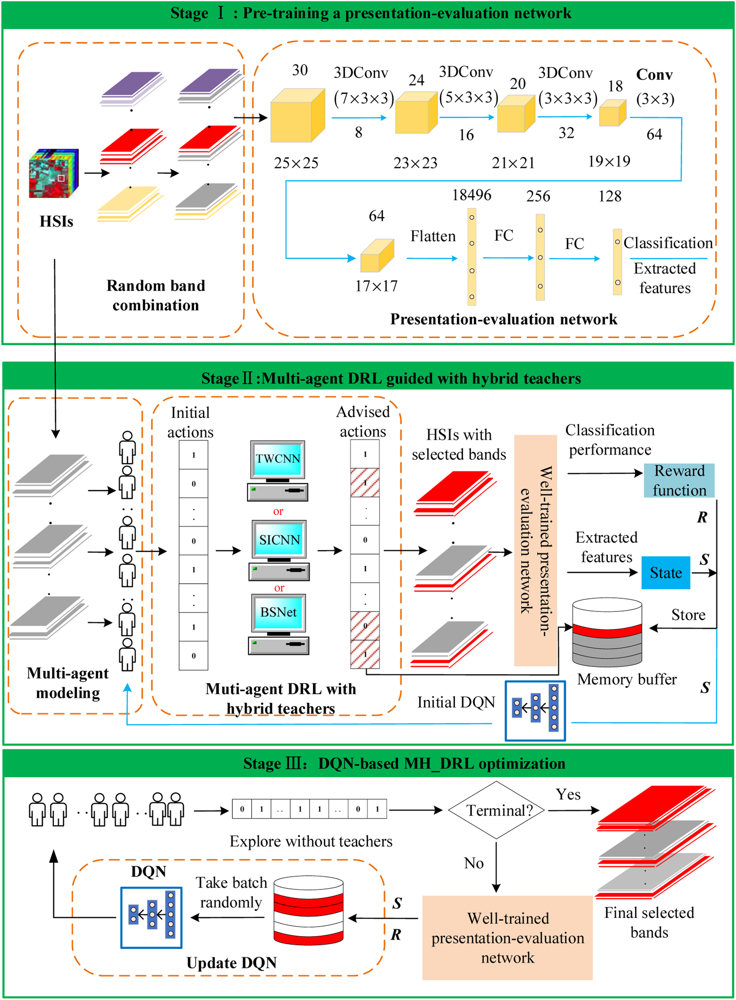
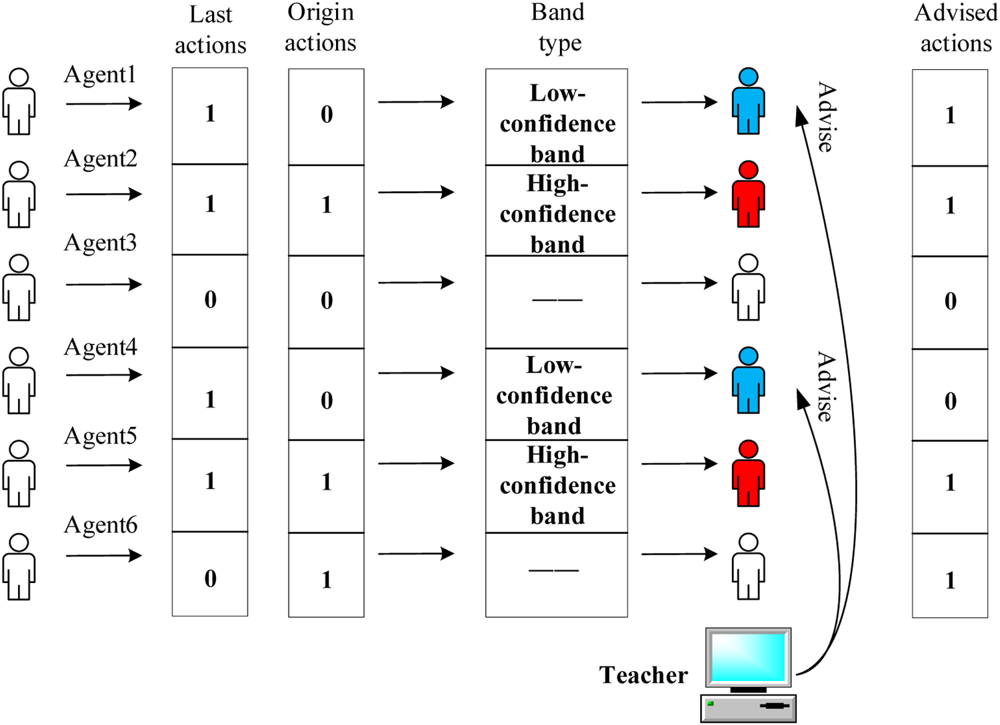
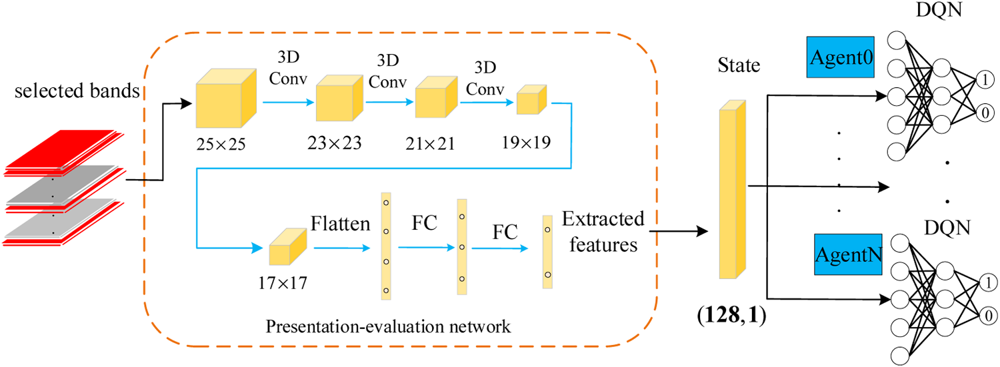
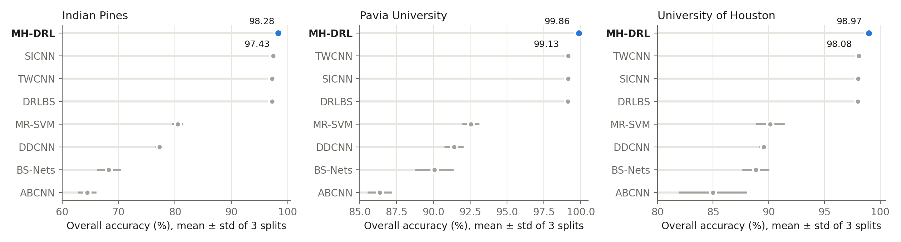
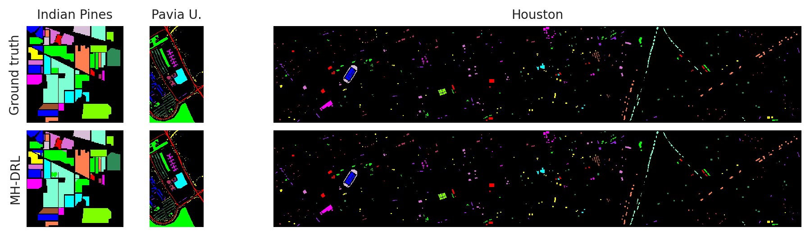
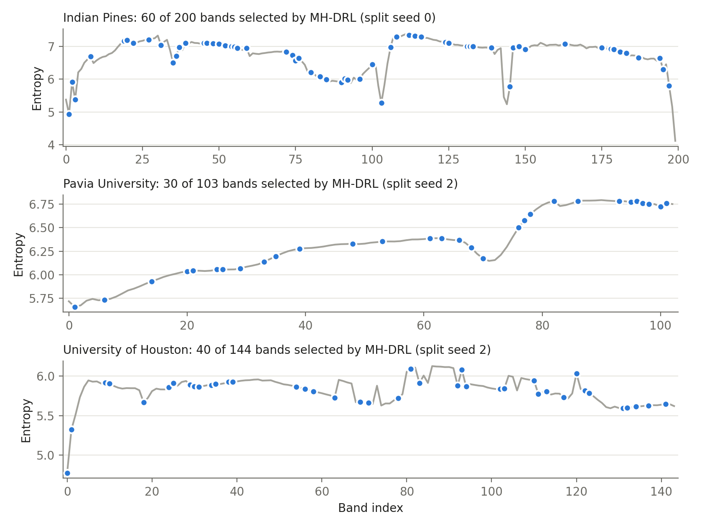
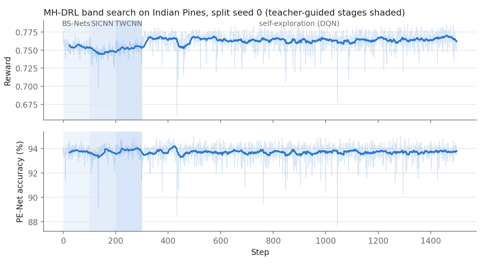

# MH-DRL
    Multi-agent Deep Reinforcement Learning for Hyperspectral Band Selection with Hybrid Teacher Guide Knowledge-Based Systems
    Jie Feng *, Qiyang Gao , Ronghua Shang , Xianghai Cao , Gaiqin Bai , Xiangrong Zhang , Licheng Jiao

- [论文地址](https://www.sciencedirect.com/science/article/pii/S0950705124006786)
- [GitHub主页](https://github.com/jiefeng0109)
- [Jie Feng主页](https://web.xidian.edu.cn/fengjie/)
- [数据集](https://github.com/Sellifake/Hyperspectral_Image_Datasets_Collection)
- [权重](../../releases)
- [实现说明](IMPLEMENTATION.md)

# Highlights

- **Multi-agent band selection.** Every spectral band is an agent that only decides *select* or *deselect*, which turns the huge action space of single-agent DRL into a binary one.
- **Presentation-evaluation network (PE-Net).** A 3D–2D CNN pre-trained with random band combinations scores any candidate band subset without fine-tuning (the reward), and its spatial-spectral features represent the environment (the state).
- **Hybrid teacher guide.** BS-Nets (filter), SICNN (wrapper) and TWCNN (embedded) take turns correcting the agents' low-confidence bands in early exploration; the agents then keep improving with deep Q-learning on their own.



<table>
<tr>
<td width="55%"><br><sub>Hybrid teacher guide: low-confidence bands are advised by the teacher.</sub></td>
<td width="45%"><br><sub>Deep Q-network of each agent.</sub></td>
</tr>
</table>

# Results

Mean ± std over 3 random splits of this PyTorch implementation.

| Dataset | Bands | OA | AA | Kappa |
|---|---|---|---|---|
| Indian Pines | 60 / 200 | 98.28 ± 0.23 | 98.26 ± 0.34 | 98.04 ± 0.26 |
| Pavia University | 30 / 103 | 99.86 ± 0.01 | 99.77 ± 0.03 | 99.82 ± 0.02 |
| University of Houston | 40 / 144 | 98.97 ± 0.25 | 99.04 ± 0.30 | 98.89 ± 0.27 |



Per-class accuracies: [results/main_table.md](results/main_table.md) · Selected bands: [results/selected_bands.json](results/selected_bands.json)

**Classification maps**



**Selected bands** (blue) on the information-entropy curve of each band



**Band search** — reward and PE-Net accuracy during the teacher-guided and self-exploration stages



# Usage

Requires a CUDA GPU.

```bash
pip install -r requirements.txt
python -m mhdrl.run --ds indian --method mhdrl --seed 0                 # band selection + evaluation
python -m mhdrl.infer --ds indian --weights weights/indian_seed0        # evaluate the released weights
bash scripts/reproduce.sh                                               # all datasets, methods and splits
```
